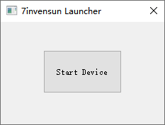

# Overview

This should support all eye trackers that are compatible with the 7invensun SDK (https://www.7invensun.com/).

== Get the SDK ==

Before you can use this app, you need to obtain the 7invensun SDK from https://www.7invensun.com.

# Usage
  * Start the 7invensun app. This should give you a window like the following:
>

  * To link the application to the LSL, click the "Start Device" button. If all goes well you should now have a new stream on the network with name "7invensun" and type "Gaze".